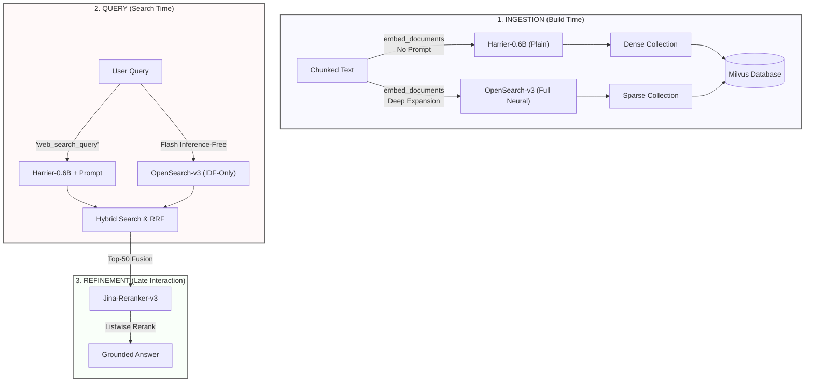

# MyRAG Implementation Documentation

## 1. Overview
MyRAG is a modular, research-oriented Retrieval-Augmented Generation (RAG) pipeline. Its primary goal is to provide a transparent, debuggable, and extensible system for transforming unstructured documents (PDFs, HTML) into a high-precision QA system. 

Unlike "black-box" RAG frameworks, MyRAG prioritizes **explainability**, allowing researchers to trace exactly which chunks were retrieved and why, and evaluate the quality of each stage using industry-standard metrics.

---

## 2. Technical Stack

### A. Document Parsing & Chunking
To ensure high-quality text extraction and structural preservation, we use a sophisticated ingestion strategy:
- **Parsing**: 
  - **PDF**: `Docling` (by IBM). It uses AI-powered layout analysis to recognize tables, formulas, and reading orders, exporting them to structured Markdown.
  - **HTML**: `Trafilatura`. It removes "boiler-plate" (headers, footers, ads) and extracts the main content.
- **Chunking**: 
  - We use `docling.chunking.HybridChunker` with `merge_peers=True` and `repeat_table_header=True`.
  - This applies token-aware refinements on top of document structure, ensuring chunks fit the embedding model's token limits.
  - Each chunk is **contextualized** (prepended with its heading hierarchy), providing critical context for retrieval.
  - `ChunkRecord`s include a **breadcrumb** (e.g., "Introduction > Methods > Data Collection") and exact **page numbers**.
  - Tables are preserved as Markdown and headers are repeated across split table chunks to maintain structural integrity.

### B. Embedding & Vector Storage
We implement a **Hybrid Retrieval** strategy using a state-of-the-art **Dual Routing** architecture to maximize both accuracy and speed:

#### 1. Dense Strategy: `microsoft/harrier-oss-v1-0.6b`
A decoder-only multilingual embedding model (Qwen-based) using last-token pooling.
- **Ingestion Path**: Documents are embedded plainly using `embed_documents()`.
- **Query Path**: Queries use `embed_query()` which automatically applies the `web_search_query` instruction prompt. This alignment is critical as the model was trained to identify relevant passages specifically when prompted with a task instruction.

#### 2. Sparse Strategy: `opensearch-project/opensearch-neural-sparse-encoding-doc-v3-gte`
An **Asymmetric, Inference-Free** learned sparse retriever.
- **Ingestion Path**: Uses the **Full Neural Model** (`model.encode_documents`) to expand documents with latent terms and importance weights.
- **Query Path**: Uses the **Inference-Free Path** (`model.encode_queries`). It utilizes a pre-computed Tokenizer + IDF weight lookup table. This removes the need for a GPU forward pass during search, resulting in near-zero latency for sparse

## 4. API Deployment (FastAPI)

The project includes a FastAPI wrapper (`api.py`) for production deployment.

### Endpoints

| Method | Endpoint | Description |
|---|---|---|
| `GET` | `/health` | Connectivity check for Milvus and Ollama. |
| `POST` | `/query` | Execute a RAG query (Retrieval + Generation). |
| `POST` | `/ingest` | Trigger background ingestion for a directory. |

### Example Query
```bash
curl -X POST http://localhost:8000/query \
  -H "Content-Type: application/json" \
  -d '{"query": "Apa itu mekanisme penelaahan usulan?"}'
```

---

## 5. Docker Deployment (Server)

For server deployment (e.g., 2x GTX 1080), use the provided Docker Compose setup.

### Dual-GPU Implementation
The `docker-compose.yml` is configured to pass through both GPUs. 
- **GPU 0**: Optimized for Dense (Harrier) and Sparse (OpenSearch) embeddings.
- **GPU 1**: Dedicated to the Jina-v3 Reranker.

### Setup Instructions
1. **Ensure Ollama is running** on the host.
2. **Build and Start**:
   ```bash
   DOCKER_BUILDKIT=0 docker compose build
   docker compose up -d
   ```
3. **Verify Health**:
   ```bash
   curl http://localhost:8000/health
   ```

### Troubleshooting
- **Security Flags**: The configuration automatically applies `--pids-limit -1` and `--security-opt seccomp=unconfined` to prevent OpenBLAS thread crashes on older Docker version (20.10.x).
- **Milvus Standalone**: Unlike the local version, the server version uses the 3-container Milvus Standalone stack for higher stability.
precision, we use a **Listwise Cross-Encoder Reranker**:
- **Model**: `jinaai/jina-reranker-v3`. A 0.6B parameter multilingual listwise reranker built on Qwen3-0.6B with a novel "last but not late" interaction architecture. It processes up to 64 documents simultaneously within a 131K token context window.
- **Process**: The retriever fetches a wide candidate pool (Top-50). The reranker then performs a deep pairwise comparison between the query and each candidate, re-sorting them to ensure the most relevant context is prioritized.

### D. Generation
- **LLM**: Local models served via **vLLM** (accessed via an OpenAI-compatible API).
- **Grounding & Attribution**: 
  - The system uses a strict system prompt that forces the LLM to rely ONLY on the provided context.
  - Each chunk is prepended with its breadcrumb: `Source [Breadcrumb]: Text`.
  - The system returns an explicit list of sources (breadcrumb, filename, page) used in the answer.

### E. Evaluation & Observability
- **Framework**: `RAGAS`.
- **Metrics**: Faithfulness, Answer Relevance, Context Precision, and Context Recall.
- **Failure Categorization**: The evaluator now automatically categorizes failures into:
  - **Retrieval Failure**: Relevant info was not in the top-50.
  - **Reranking Failure**: Relevant info was in top-50 but ranked too low for the LLM.
  - **Generation Failure**: Correct context was present, but the LLM failed to answer.
- **Synthetic QA**: A module that uses the LLM to generate "Ground Truth" Q&A pairs from your documents.

## 3. The Dual-Routing Map



---

## 4. Pipeline Data Flow

### Ingestion Flow
`Raw Files` $\rightarrow$ `Docling/Trafilatura Parsing` $\rightarrow$ `Hybrid Chunking` $\rightarrow$ `Dense & Sparse Embedding` $\rightarrow$ `Milvus Storage (with Breadcrumbs & Page Nos)`

### Query Flow
`User Query` $\rightarrow$ `Dual Embedding` $\rightarrow$ `Milvus Hybrid Search` $\rightarrow$ `Metadata Filtering (Optional)` $\rightarrow$ `Reciprocal Rank Fusion (RRF, k=60)` $\rightarrow$ `Top-50 Candidates` $\rightarrow$ `Jina Reranking` $\rightarrow$ `Top-5 Context` $\rightarrow$ `Grounded Generation` $\rightarrow$ `Answer + Sources`

---

## 4. Pipeline Capabilities & Usage

### 4.1 Ingesting Data
**What it does**: Processes files/directories and indexes them.
**How to do it**:
```bash
python src/my_rag/cli.py ingest --config config_rag.yaml --directory ./my_docs
```

### 4.2 Standard QA
**What it does**: Retrieves context and generates an answer.
**How to do it**:
```bash
python src/my_rag/cli.py query --config config_rag.yaml --query "What is the result of the study?"
```

### 4.3 Document-Specific Search
**What it does**: Restricts the search to only one or a few specific documents.
**How to do it**:
```bash
python src/my_rag/cli.py query --config config_rag.yaml --query "..." --doc-ids doc_001 doc_005
```

### 4.4 Keyword Debugging (The "Tracing" Feature)
**What it does**: Verifies if a specific keyword exists in the database and identifies which chunks contain it.
**How to do it**:
```bash
# Find all chunks containing a word
python src/my_rag/cli.py find-keyword --config config_rag.yaml --keyword "neural network"

# Trace if a specific query's results actually contained a required keyword
python src/my_rag/cli.py trace --config config_rag.yaml --query "..." --check-keyword "activation"
```

### 4.5 Evaluation
**What it does**: Measures the system's performance using RAGAS and categorizes failures.
**How to do it**:
```bash
# Generate synthetic QA and evaluate them
python src/my_rag/cli.py eval --config config_rag.yaml --synthetic --paths ./data/doc.pdf
```

---

## 5. Extensibility Guide

### Adding a New Parser
1. Create a class inheriting from `BaseParser` in `ingestion/`.
2. Implement `extract()` and `accepts_extension()`.
3. Register it in `IngestionPipeline.process_file()`.

### Changing the Embedding Model
1. Update `embedding.dense_model` or `embedding.sparse_model` in `config_rag.yaml`.
2. Re-run the `ingest` command to update the Milvus index.

### Adding New Evaluation Metrics
1. Add the metric class from `ragas.metrics` to the `metric_map` in `evaluation/evaluator.py`.
2. Add the metric name to the `metrics` list in `config_rag.yaml`.

